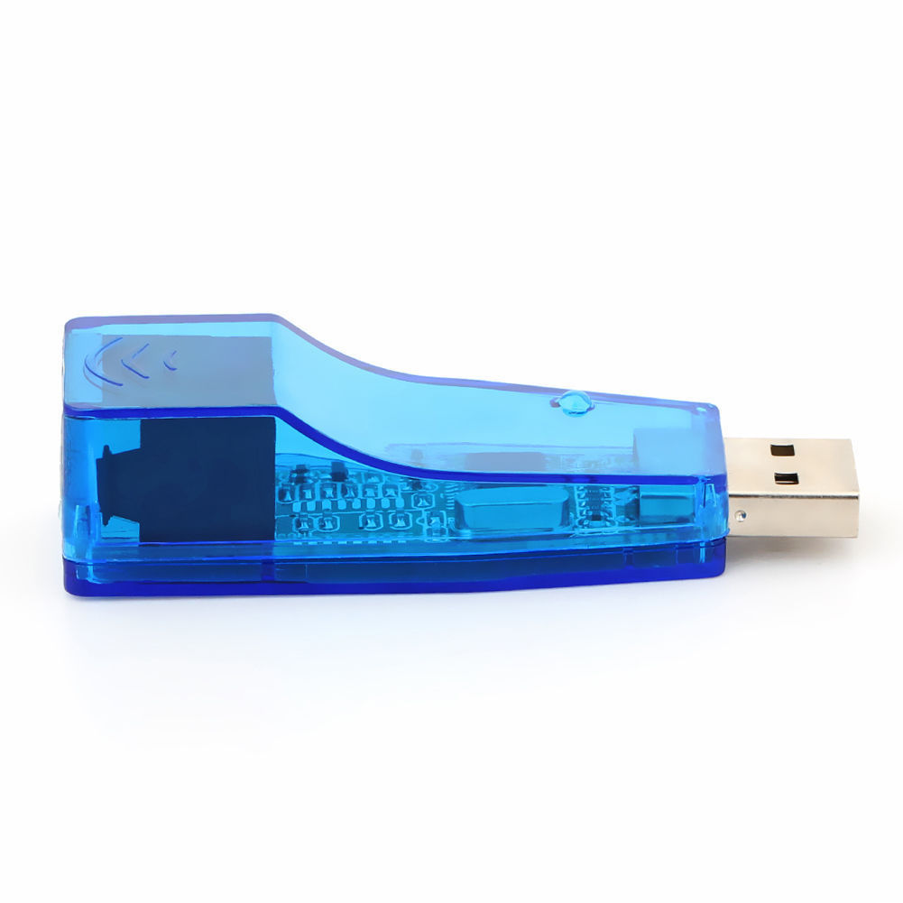
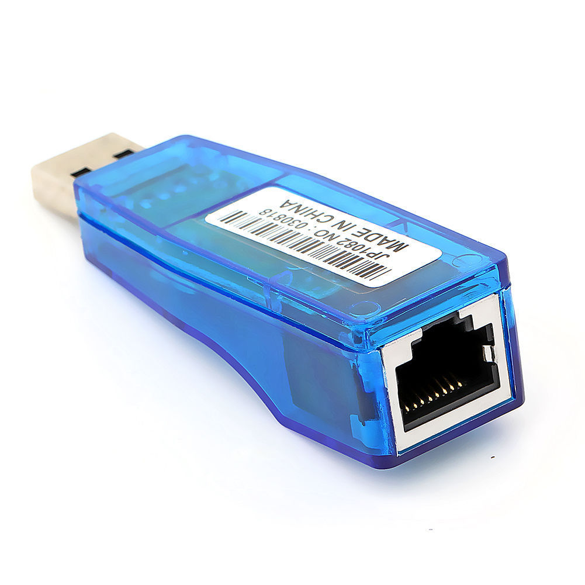
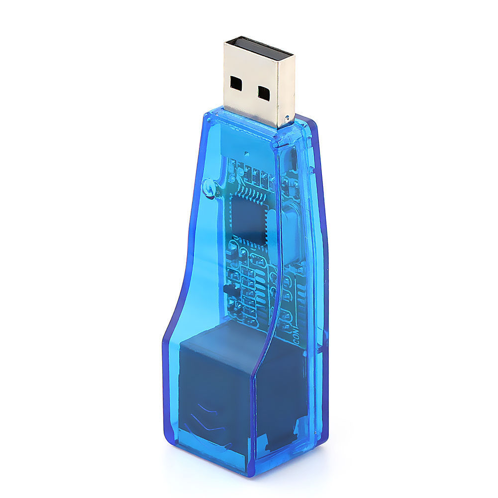
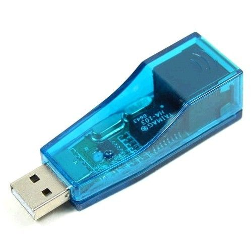

<h1>RD9700-Driver</h1>

<h1>Driver for:</h1>
<h2>USB 2.0 To LAN RJ45 Ethernet Network Card Adapter For PC 10/100Mbps</h2>

<h1>I don't own this shitty driver, nor I provide any help for you to compile/use it, I simply provide it as is for you to play with it, I recommend you'll take the 1.50$ device and throw it into the trash, and never install this shitty pack of drivers.</h1>

<h2>Provided AS IS!</h2>

This is the entire pack of driver including source-code for the shitty and cheap CORECHIP Semiconductor 10/100 USB 2.0 to RJ45 Network Device, You can use with your PC or Android device with it. Clean Of Virus Using virustotal.com

You can download the entire thing by git-clone to your desktop, by hand (clicking the files in here), or visiting the (simple) github page. all same. as for installation, figure it for yourself,

I saw that the drivers for windows DID have some kind of certificate, but it still might break your windows, so figure out things for yourself.. :|

Content:
<pre>
+---Linux
|   |   .qf9700.ko.cmd
|   |   .qf9700.mod.o.cmd
|   |   .qf9700.o.cmd
|   |   Makefile
|   |   Module.markers
|   |   Module.symvers
|   |   modules.order
|   |   qf9700.c
|   |   qf9700.h
|   |   qf9700.ko
|   |   qf9700.mod.c
|   |   qf9700.mod.o
|   |   qf9700.o
|   |   README
|   |   
|   \---.tmp_versions
|           qf9700.mod
|           
+---MAC DRIVER
|   +---i386
|   |       USBCDCNET.pkg
|   |       
|   +---ppc
|   |       USBCDCNET.pkg
|   |       
|   \---x86_64
|           USBCDCNET.pkg
|           
+---sr9700_android_2.6.35
|       Makefile
|       sr9700.c
|       sr9700.h
|       
+---WINCE500
|       CoreChip QF9700 USB Driver For WINCE 5.0.cab
|       QF9700USB.bib
|       QF9700USB.dll
|       QF9700USB.reg
|       README.txt
|       
+---WINCE600
|   \---QF9700Release
|           CoreChip QF9700 Driver For Windows CE 6.0.cab
|           QF9700USB.bib
|           QF9700USB.dll
|           QF9700USB.reg
|           README.txt
|           
+---winXP-WIN8-64
|       rd9700.cat
|       RD9700.inf
|       RD9700.sys
|       
\---XP-WIN8-32
        rd9700.cat
        RD9700.inf
        RD9700.sys
        
</pre>

